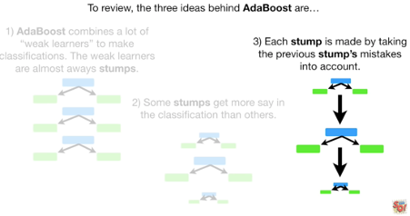

# Decision Trees & Random Forests

Random Forests consisting of Decision Trees can be used for both classification and regression problems, and for data clustering/visualisation and they can handle data types that are Boolean, categorical or continuous, they can also be used if there is missing data in either the training or test sets. Decision trees aim to learn simple decision rules inferred from training data. Random forests are one of the best performing 'out of the box models' and they do not require data mean scaling/normalisation. 

Terminology

* root node - represents the entire population and poses a question that divides into 2 sets.
*	internal/decision node - a node with arrows coming from and going to it, it also contains a question to split data into 2 sets.
*	leaf/terminal node - final node which does not split, does not contain a question, just contains collection of data points that followed that path.
*	Gini impurity - leafs rarely have perfectly separated the data so that they only contain targets or only contain not targets, but rather they are usually a mix (maybe lots of targets and a few non targets). This mixture makes them impure and the quantity of separation achieved can be measured by the Gini impurity value (shown later).

Handling data types
*	Boolean data - naturally catered for with True or False question, node that splits in two.
*	Categorical data - handled with series of binary options, such as contains categories A, B, C and D, vs contains E, F, and G, then next sub internal node may be contains A and B or contains C and D and so on.
*	Numerical data is handled by splitting data at a weight value, eg is value < 80. The value of the weight is chosen by fitting data. This makes numerical data categorical which is easier to handle.

Decision tree structure
*	nodes have to be binary options.
*	trees don’t need to be symmetrical, the questions on the left branch do not need to be mirror opposite of questions on right branch).

Building a decision tree
The order of questions in the decision tree is very important and it affects the accuracy of the model. Below we describe how to pick the order using an example where we are trying to predict a Boolean variable (heart disease), using three Boolean input variables (chest pain, blood circulation and blocked arteries).
*	pick the root node question by trying each of the input variables in turn and seeing how they will split the data into two groups. Look at the leaf nodes for each case, and assess how well this decision node split the data according to the target variable. Ideally we want this question to split the target variable perfectly, so all the people with heart disease go to one leaf and all those without go to the other. In reality you don’t get perfect separation so you quantify how well the decision split the data using the Gini impurity measure for each leaf, then calculated the weighted Gini impurity from all leaves of the decision node. Repeat process for all input variables and select the one that results in the lowest Gini impurity value. Note record the Gini impurity value for each leaf and node as that will be used later.
*	If there are input variables that have not been used yet, pick sub nodes for each leaf node remaining. This is a repeat process as above. Calculate the gini impurity for each leaf node and check that the impurity is improving (reducing) due to the addition of the extra decision variable.
*	Repeat until all input variables are used or stop when adding additional data does not reduce the Gini impurity value of the leaves compared to the parent node.
*	If you were dealing with numerical data, there are more options as there are different ways to split the variable into discrete categorical variables. Hence this process becomes a lot more work.

## Random Forests
Decision trees are easy to build, easy to use and interpretable, but they are inaccurate when working with data not used in the training set. But, Random Forests overcome this problem and increase the accuracy of the model.

A random forest consists of
*	hundreds of decision trees (it is an ensemble model)
*	the decision trees are all made using different bootstrapped data set, (a dataset where you pick with replacement from your original data set) hence they will be slightly different.
*	Each decision tree is built using only a random subset of variables/features at each step, hence your hundreds of decision tress in the forest will have a wide diversity (this diversity makes a forest more accurate than an individual tree). Typically if you have N variables, you should consider the square root of N randomly chosen variables at each step in your decision tree. Note you are allowed to use each variable many times, so just because variable X was used in the 2nd layer of the tree, that doesn’t mean you cant use X again at 9th layer in the tree.
*	You then run every data point, through each tree in your random forest. You then compare the predictions from all your trees and you chose the most common output from your forest to be the output from the tree. Its like all the trees in the forest vote on the output. Terminology, getting this aggregate value is called bagging.
*	Terminology, the test data is the data not used in the bootstrapped data set, this is called an out of bag dataset.
*	The random forest creation process is often repeated 10 times, using  different hyper parameters when building the random forest, for example the number of variables you consider at each step when building a decision tree (usually somewhere around the square root of N, where N is the number of features), or a different number of trees in the forest, or a different fraction for the bootstrap sample size (if 100 rows in original dataset, does your bootstrap sample consists of 50, 90, 100 or 120 rows randomly chosen with replacement), or maximum tree depth.

## AdaBoost

AdaBoost (adaptive boosting) is a machine learning meta algorithm meaning it is applied on top of other algorithms most often random forests. AdaBoost is often referred to the best out of the box machine learning classifier. It has a huge advantage in that it does not suffer from over fitting.
AdaBoost is used in cases with high dimensionality and it can improve the performance of your classifier.
AdaBoost is a type of ensemble classification algorithm where the combined contributions of a large number of ‘weak learners’ are combined to produce a single boosted classifier that is a strong learner. A weak learner is a binary classifier that is only slightly better than a coin flip, a common weak learner is a decision tree or decision tree stump.
In the context of applying AdaBoost to random forests there are three major ideas

1. Instead of making a forest of full decision tress which could have any depth, we instead restrict our decision trees to be decision stumps, where a stump is a tree that just consists of a single node with two leaf nodes. Stumps are poor classifiers and are ‘weak learners’ as required by the AdaBoost methodology. Stumps are trained on a subset of the data (the exact method of picking the subset is described later), then their accuracy is determined on the full dataset. Or stumps are trained on the entire data set but with custom weights for each data point (the method of picking the weight is described later), the error of the stump is then assessed on the full dataset without the weights.
2. In a standard random forest each decision tree gets an equal vote when making the final score for the classifier. In the AdaBoost method, different stumps get different weights based on how well it classified the samples. See below the function for determining the amount of say a stump has in the total classification. Error ranges from 0 to 1 and it is the fraction of samples that are misclassfied, a coin toss should give an error rate of 0.5. If your stump has an error of 0.5 similar to a coin toss, its amount of say will be close to 1, if its error is very low it has a large say and if its error is higher than 0.5, meaning the classifier is wrong more often then it is right then its amount of say will be negative.
3.	In a standard random forest each decision tree is made independently of the others, but in AdaBoost, each stump is influenced by the stumps that came before as each stump aims to perform well on the samples which were previously misclassified. There are two methods for doing this, the first is assigning a greater weight to the samples which were previously misclassified, and the second is to just design your next stump using only the samples which were incorrectly classified by the previous stump.  Using the weighted approach for desinging the next stump is shown below. We update the sample weight for each sample at every iteration, the samples that were correctly classified by the previous stumps are decreased and the samples wich were incorreclty classified by the previous stump are increased. Hence the model tries ot do better on the samples it got wrong before. Note the amount by which you increase or decrease the weights at each iteration is a function of the amount of say the previous stump had, this is because if the previous stump had no say, it doesn’t really matter so the weights should not update much, but if the previous stump had a lot of say the weights should update a lot.

Boosting and overfitting.

One of the most exciting properties of boosting is that it cannot overfit the data. This is a very strange result as over fitting is a common problem in neural networks and other machine learning approaches. Currently researchers do not know why boosting does not suffer from over fitting and this observation is an experimental one, rather than a mathematical proof.

As a reminder, over fitting is when you train your model too much (too many parameters in your model or you train a neural network for too long) on the sample data so that it begins to fit noise or outliers rather than just learning a good space for decision boundaries. This is a problem as later in another test set, you may get a sample that lands in one of these over fitted spaces and hence it will be incorrectly mis-classified, when in reality a simpler/non over fitted model would have got it correct. Generally overfitting is observed as a significant drop in performance from the train to the test sets. See diagrams explaining this below. Note that boosting does not suffer from over fitting which is a problem as you get large areas in your sample space that are put into the wrong area in order to accommodate outliers. Boosting does not do this as it wraps the outliers in such small volumes that there is very little chance that a test data point will fall there. This does mean that the performance of your test set wont be as good as on your train set (as you can expect up to perfect performance on the train set due to wrapping the outliers), but the performance on your test set is not made worse due to over fitting to the training set. 

